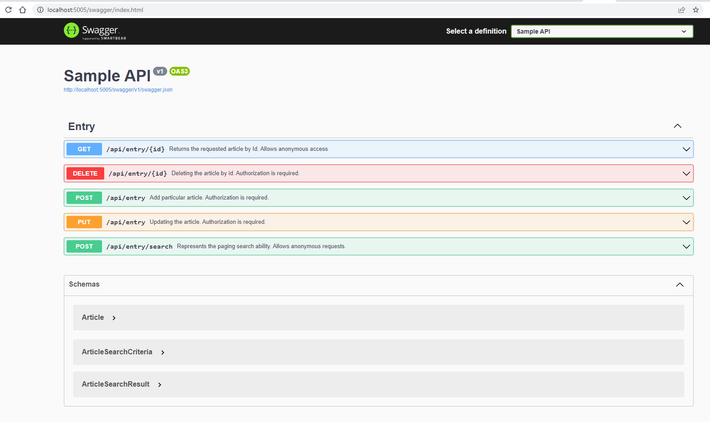

# About
ASP.NET sample project with sample CRUD API protected by simple token.

# Using technologies and patterns
* [3 layers architecture](https://github.com/pushnitsa/ASPSampleApplication/tree/main/src)
* JSON and XML [response formatting](https://github.com/pushnitsa/ASPSampleApplication/blob/main/src/ASPSampleApplication.Web/Startup.cs#L34), with respecting browser requesting HTTP-Header whether ```Accept: text/json``` or ```Accept: text/xml```
* [Repository](https://github.com/pushnitsa/ASPSampleApplication/tree/main/src/ASPSampleApplication.Data/Repositories)
* [Factory](https://github.com/pushnitsa/ASPSampleApplication/blob/main/src/ASPSampleApplication.Web/Startup.cs#L80)
* Swagger
* Automapper
* [Dynamic LINQ](https://dynamic-linq.net/) (advanced sorting scenario)
* Docker
* Docker compose
* xUnit
* AutoFixture
* Moq

# Installation
This sample project implemented using .NET 6, so you need to VS 2022 and .NET 6 to review it.

## Prerequisites
* Git
* .NET 6 SDK
* Visual Studio 2022
* Docker
* Docker compose

## Steps
1. Pull the repo: ```git clone https://github.com/pushnitsa/ASPSampleApplication.git```
2. CD to the repo dir: ```cd ASPSampleApplication```
3. Publish it: ```dotnet publish .\src\ASPSampleApplication.Web\ASPSampleApplication.Web.csproj```
4. Run docker-compose: ```docker-compose up --build --force-recreate```
5. Wait until it's running and visit [http://localhost:5005](http://localhost:5005)

It should be enough to test the application

# Usage
The API provide an opportunity to make a CRUD operations according to just one entity.

## Basics
Home page with link to the Swagger


Swagger UI



### Searching
Basic search scenario wasn't implemented.
However, there is an opportunity to take entries by paging, with sorting expressions.

Note: There are no any validation for sorting expressions. An exception could happen if dab data would be found.


## Authorization
Create, Update, Delete endpoints are "protected" :)
You should define HTTP-Header to make the call.
Otherwise, you'll get an 401 HTTP response.


To make a deal with it, send:
```
X-SAMPLE-AUTH-TOKEN: SampleTokenValue
```
Note: Both values are configurable through configure an environment variable


## Documentation
The Swagger generates an API documentation automatically.


Becomes


## XML view
You could get an XML response view. Relying to request headers.


## Configuring
Connection string and auth credentials as well, could be configured via environment variables.

## Unit tests
Just one test was added. Only for demo purposes.